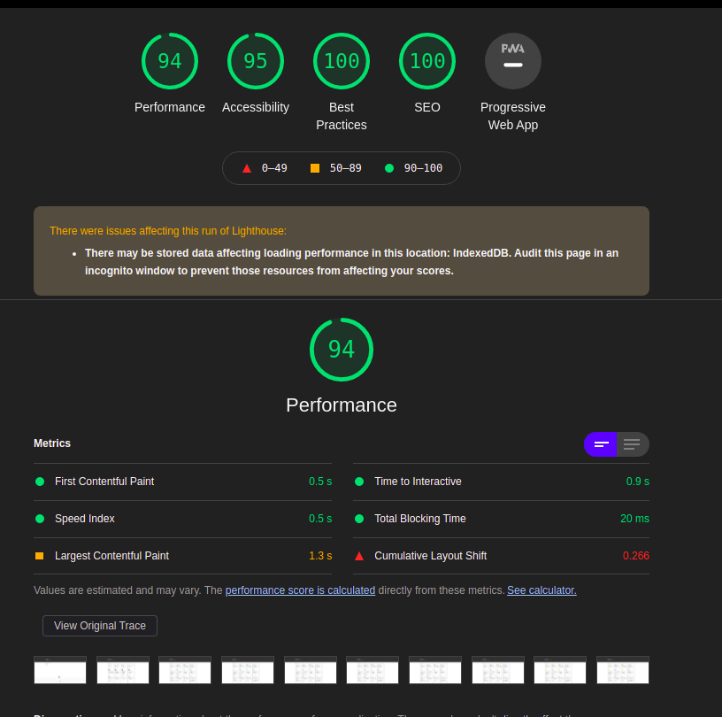

## Breweries

### Tarefas

As seguintes tarefas foram realizadas para o projeto:

- [x] Consumir dados da Open Brewery DB.
- [x] Tela inicial (home)
- [x] Tela de detalhes
- [x] Filtro por brewery_type
- [x] Paginação
- [x] Abrir localização do Google Maps com um "pin"


This is a [Next.js](https://nextjs.org/) project bootstrapped with [`create-next-app`](https://github.com/vercel/next.js/tree/canary/packages/create-next-app).

## Getting Started

First, run the development server:

```bash
npm run dev
# or
yarn dev
```

To see lighthouse metrics:

```bash
yarn build
# and
yarn start
```




